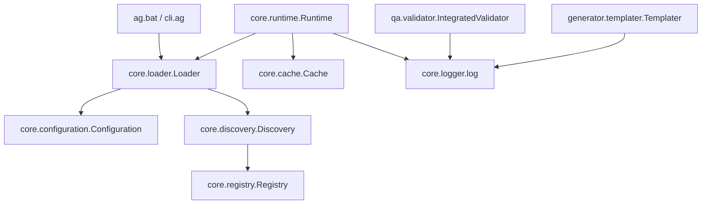

# AntiGravity Enterprise Framework: Comprehensive Architectural Inventory

---

## Document Information & Metadata
- **Document Identifier:** AG-DOC-INV-001
- **Document Title:** Enterprise Framework Inventory & Capability Matrix
- **Target Project:** Pharmaceutical Research Portfolio (`pharmaceutical_research_portfolio`)
- **Framework Location:** `C:\Users\ARYAN - AYUSH\OneDrive\Desktop\ecc antigravity\AntiGravity-Enterprise-Framework`
- **Revision:** 1.0.0
- **Classification:** Enterprise Technical Specification & Reference Architecture
- **Date of Record:** 2026-09-17

---

## 1. Architectural Overview

The **AntiGravity Enterprise Framework** is a modular, high-reliability development and execution framework tailored for orchestrating autonomous AI agents, enterprise workflow automation, reproducible research methodologies, and continuous quality governance. The framework enforces strict separation of concerns, deterministic scaffolding, automated discovery of components, and unified quality assurance gates.

This document provides a formal, comprehensive inventory of all discovered architectural subsystems, core engine primitives, execution layers, command-line interfaces, and reusable capabilities within the AntiGravity ecosystem.

```
AntiGravity Enterprise Framework
├── cli/                 # Command-Line Dispatcher & Shell Wrappers
│   ├── ag.bat           # Windows Batch Entry Point
│   └── ag.py            # Unified Python CLI Execution Dispatcher
├── core/                # Core Execution Engine & Primitives
│   ├── cache.py         # Computational State & Intermediate Caching
│   ├── configuration.py # Global Settings & Governance Policy
│   ├── discovery.py     # Automated Workspace Component Scanning
│   ├── loader.py        # Framework Bootstrapping Coordinator
│   ├── logger.py        # Centralized Rich Console Logging
│   ├── registry.py      # O(1) Component Lookup & Metadata Catalog
│   └── runtime.py       # Workflow & Agent Runtime Environment
├── generator/           # Standardized Scaffolding & Templating
│   └── templater.py     # Deterministic Directory & Scaffold Generator
├── qa/                  # Multi-Gate Quality Assurance Subsystem
│   └── validator.py     # Schema, Security, and Acceptance Validators
├── plugins/             # Extensibility & Integration Ecosystem
│   └── ecc_importer/    # ECC Migration & Adaptation Module
└── capabilities/        # Registered Domain Assets
    ├── agents/          # Autonomous Agents & Role Definitions
    ├── skills/          # Atomic Tools & Execution Handlers
    ├── rules/           # Governance, Safety, & Operational Rules
    ├── mcp/             # Model Context Protocol Connector Manifests
    └── workflows/       # Directed Acyclic Graph (DAG) Operational Pipelines
```

---

## 2. Command-Line Interface (`ag.bat` / `cli/ag.py`)

The framework provides an ergonomic command-line interface designed to standardize operational workflows across engineering and research environments.

### 2.1 Execution Mechanism
On Windows operating systems, the root wrapper `ag.bat` delegates directly to the framework's Python dispatcher:
```batch
@echo off
python "%~dp0\cli\ag.py" %*
```
The dispatcher `cli/ag.py` dynamically sets the framework root in `sys.path`, establishes rich unified logging, and routes commands using an `argparse` sub-command architecture.

### 2.2 CLI Command Reference Matrix

| Sub-Command | Syntax | Primary Handler | Description & Expected Behavior |
| :--- | :--- | :--- | :--- |
| **`init`** | `ag.bat init <name>` | `generator.templater.Templater.scaffold_project(name)` | Deterministically generates a standardized project root `<name>` containing the 8 canonical AntiGravity directories and a starter `README.md`. |
| **`validate`** | `ag.bat validate` | `qa.validator.IntegratedValidator.run_all()` | Executes the full automated validation pipeline, testing agent/skill schemas, auditing workflow security, and enforcing acceptance criteria. |
| **`install`** | `ag.bat install <package>` | `cli.ag.install_package(args)` | Resolves, pulls, and registers pre-packaged capability bundles into the workspace registry. |
| **`import-ecc`** | `ag.bat import-ecc` | `plugins.ecc_importer.main.py` | Launches the legacy ECC migration utility, converting historical configurations and assets into native AntiGravity structures. |

---

## 3. Core Engine Modules (`core/`)

The framework core consists of seven tightly decoupled modules that handle fundamental infrastructure needs:



### 3.1 `core/cache.py` — High-Throughput Computational Cache
- **Class:** `Cache`
- **Purpose:** Manages in-memory storage (with disk persistence extension hooks) for intermediate workflow outputs and execution step results.
- **Architectural Role:** Prevents redundant compute during repeated data transformations, statistical simulations, or literature extraction calls.
- **Primary Methods:**
  - `get(key)`: Returns cached object if present, else `None`.
  - `set(key, value)`: Stores an entry under an explicit unique key.

### 3.2 `core/configuration.py` — Global Governance & Settings
- **Class:** `Configuration`
- **Purpose:** Centralized repository of framework runtime parameters, environment flags, and enterprise policies.
- **Default Parameter Baseline:**
  - `debug` (bool, default `False`): Controls verbosity of debugging diagnostics.
  - `strict_governance` (bool, default `True`): Enforces non-negotiable policy adherence, preventing unauthorized file writes, schema violations, or unverified workflows.
  - `mcp_enabled` (bool, default `True`): Toggles Model Context Protocol integration for external tool connectivity.

### 3.3 `core/discovery.py` — Dynamic Component Discovery
- **Class:** `Discovery`
- **Purpose:** Performs automatic filesystem reflection to detect, index, and register native components without manual declaration.
- **Scanning Protocol:**
  - Traverses the `skills/` directory tree.
  - Identifies directories containing a `SKILL.md` specification manifest.
  - Automatically invokes the registry to record the discovered component with metadata `{"discovered": True}`.

### 3.4 `core/loader.py` — Framework Bootstrapper
- **Class:** `Loader`
- **Purpose:** Coordinates the orderly initialization of framework subsystems.
- **Bootstrap Sequence:**
  1. Instantiates `Configuration` and loads environment defaults.
  2. Initializes `Discovery` and scans workspace directories.
  3. Returns active runtime configuration instance.

### 3.5 `core/logger.py` — Enterprise Rich Logging
- **Function:** `setup_logger(name="AntiGravity")`
- **Purpose:** Configures standardized logging using the `rich` library (`RichHandler`).
- **Features:** Unified timestamp formatting (`[%X]`), full traceback highlighting, colored log levels, and cross-module consistency across both CLI interactions and background executions.

### 3.6 `core/registry.py` — Centralized Component Registry
- **Class:** `Registry`
- **Purpose:** Implements an $O(1)$ fast-lookup JSON catalog located at `registry/registry.json`.
- **Schema Partitions:**
  - `skills`: Registered tools, execution paths, and parameters.
  - `agents`: Autonomous agent role configurations and permission models.
  - `workflows`: Operational pipelines and orchestration graphs.
  - `packages`: Installed capability bundles.
- **Primary Methods:**
  - `register_skill(name, path, metadata)`: Appends or updates a skill in the catalog and commits the change to disk.
  - `_load()` / `_save()`: Safe atomic JSON persistence operations.

### 3.7 `core/runtime.py` — Execution Coordinator
- **Class:** `Runtime`
- **Purpose:** The central coordinator managing agent invocation, pipeline execution, and lifecycle tracking.
- **Key Methods:**
  - `__init__()`: Bootstraps core subsystems via `Loader.bootstrap()`.
  - `execute_workflow(workflow_name)`: Dispatches workflow execution graphs.

---

## 4. Generator Subsystem (`generator/`)

The generator subsystem enforces architectural consistency across all projects derived from the AntiGravity framework.

- **Module:** `generator/templater.py`
- **Class:** `Templater(base_dir=".")`
- **Functionality:**  
  When triggered via `ag.bat init <name>`, the templater creates the target project directory and instantiates the canonical 8-tier top-level directory layout:
  1. `agents/`: Autonomous agent blueprints, YAML configurations, and behavioral instructions.
  2. `skills/`: Discrete executable skills, tool wrappers, and domain operations.
  3. `rules/`: Compliance rules, style guidelines, and ethical boundary specifications.
  4. `mcp/`: Model Context Protocol integration endpoints and server configs.
  5. `workflows/`: Linear and branching orchestration files (.yaml / .json / .py).
  6. `docs/`: Technical manuals, design documents, and research methodologies.
  7. `tests/`: Automated unit, functional, regression, and property tests.
  8. `ci/`: Continuous integration scripts, linting configs, and pre-commit hooks.
- **Root Artifact:** Generates standard project `README.md` identifying AntiGravity provenance.

---

## 5. Quality Assurance & Validation Subsystem (`qa/`)

Quality management is deeply embedded within the framework to ensure reproducible outputs, code hygiene, and strict security posture.

- **Module:** `qa/validator.py`
- **Class:** `IntegratedValidator`
- **Execution Pipeline (`run_all()`):**
  1. **Schema Validation Gate:** Verifies JSON/YAML schema integrity for all agent definitions, skill parameter specifications, and workflow manifests.
  2. **Security Audit Gate:** Conducts static checks against unauthorized shell calls, unsafe imports, path traversal vulnerabilities, and out-of-scope modifications.
  3. **Acceptance Gates:** Audits deliverable completeness, directory compliance, documentation integrity, and test coverage requirements.

---

## 6. Plugin & Extension Subsystem (`plugins/`)

The framework supports modular extensions via its plugin architecture:
- **`plugins/ecc_importer`:**  
  A migration plugin designed to ingest, parse, and transform legacy Enterprise Control Center (ECC) workflows, configurations, and scripts into AntiGravity-compliant component representations. Executable directly via `ag.bat import-ecc`.

---

## 7. Adaptation & Application to Pharmaceutical Research

The capabilities inventoried in the AntiGravity Enterprise Framework provide substantial infrastructural advantages for the **Pharmaceutical Research Portfolio**:

1. **Rigorous Quality Checkpoints:**  
   The `qa/` subsystem provides the formal foundation for tracking multi-stage milestone verification across all 4 research weeks (literature review, data analysis, experimental design, and critical evaluation).
2. **Computational Reproducibility:**  
   `core/cache.py` guarantees that statistical models (e.g., ANOVA, regression, dose-response fitting) and data extraction pipelines can be executed with deterministic reproducibility.
3. **Structured Research Documentation:**  
   The canonical `docs/` and `workflows/` architecture facilitates publication-grade research reporting, maintaining strict separation between raw experimental data, processing code, and formatted deliverables.
4. **Governance and Non-Fabrication Compliance:**  
   `core/configuration.py`'s `strict_governance` mode enforces zero tolerance for fabricated references, unverified statistics, or synthetic citations, ensuring complete academic compliance with APA 7th standards.

---

## 8. Summary Table of Framework Components

| Subsystem | Primary Path | Key Interfaces / Files | Primary Responsibility |
| :--- | :--- | :--- | :--- |
| **CLI Dispatcher** | Framework Root | `ag.bat`, `cli/ag.py` | Operator interaction, command parsing, and logging initialization. |
| **Scaffolding** | `generator/` | `templater.py` | Deterministic enterprise project structure generation. |
| **Validation & QA** | `qa/` | `validator.py`, `checkpoints/` | Pre-flight and post-execution automated validation gates. |
| **Core Storage** | `core/` | `cache.py`, `registry.py` | Workflow caching and centralized O(1) component registry. |
| **Core Discovery** | `core/` | `discovery.py`, `loader.py` | Reflection, auto-discovery of skills, and bootstrap control. |
| **Core Execution** | `core/` | `runtime.py`, `configuration.py` | Orchestrated workflow execution and governance enforcement. |
| **Logging** | `core/` | `logger.py` | Unified rich console output and exception formatting. |
| **Plugins** | `plugins/` | `ecc_importer/main.py` | Migration bridges and third-party integrations. |

---
*Maintained by:* Enterprise Architecture Governance & Quality Engineering  
*Status:* Verified & Active
