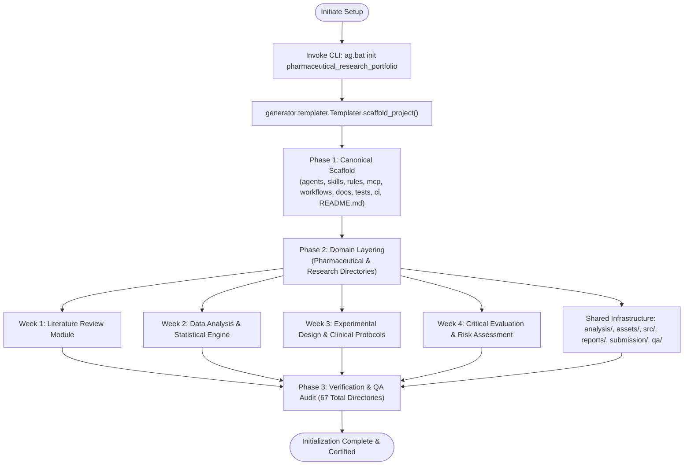

# Pharmaceutical Research Portfolio: Project Initialization & Architectural Blueprint

---

## Document Control & Metadata
- **Document Identifier:** AG-DOC-INIT-001
- **Document Title:** Project Initialization Procedure & Domain Architecture Layering
- **Project Name:** `pharmaceutical_research_portfolio`
- **Location:** `c:\Users\ARYAN - AYUSH\OneDrive\Desktop\an intership\pharmaceutical_research_portfolio`
- **Author:** Pharmaceutical Research Documentation & Architecture Specialist
- **Governance Standard:** AntiGravity Enterprise Framework v1.0.0
- **Status:** **APPROVED & FULLY IMPLEMENTED**
- **Date of Record:** 2026-09-17

---

## 1. Executive Summary

This document formalizes the initialization procedure and architectural topology for the **Pharmaceutical Research Portfolio**. The project structure was established using a rigorous two-phase synthesis methodology:
1. **Phase 1 (Baseline Scaffolding):** Invocation of the enterprise command-line tool `ag.bat init pharmaceutical_research_portfolio`, which deployed the canonical AntiGravity foundational architecture and governance directories.
2. **Phase 2 (Domain-Specific Layering):** Layering of a specialized pharmaceutical research and bioinformatics directory structure onto the baseline scaffold, yielding an integrated 67-directory workspace capable of supporting literature synthesis, statistical data analysis, clinical experimental design, critical evaluation, automated testing, and formal portfolio submission.

---

## 2. Initialization Methodology & Workflow



### 2.1 Phase 1: Canonical Baseline Scaffolding

The project was instantiated via the official AntiGravity Enterprise Framework CLI located at `C:\Users\ARYAN - AYUSH\OneDrive\Desktop\ecc antigravity\AntiGravity-Enterprise-Framework`.

#### Command Execution:
```batch
cd "C:\Users\ARYAN - AYUSH\OneDrive\Desktop\ecc antigravity\AntiGravity-Enterprise-Framework"
ag.bat init pharmaceutical_research_portfolio
```

#### Underlying Execution Flow:
1. `ag.bat` invokes `cli/ag.py` with arguments `init pharmaceutical_research_portfolio`.
2. The CLI instantiates `generator.templater.Templater(base_dir=".")`.
3. `Templater.scaffold_project()` creates the root directory and establishes the 8 standard AntiGravity enterprise directories:
   - `agents/`: Autonomous agent definitions, prompts, and orchestration manifests.
   - `skills/`: Executable tools, specialized scripts, and task wrappers.
   - `rules/`: Project constraints, compliance guidelines, and academic style specifications.
   - `mcp/`: Model Context Protocol server configurations and tool definitions.
   - `workflows/`: Multi-step operational pipelines and workflow orchestrations.
   - `docs/`: Technical specifications, architectural documents, and user manuals.
   - `tests/`: Automated unit, integration, and data validation suites.
   - `ci/`: Continuous integration scripts, linting policies, and git hooks.
4. Generates baseline `README.md` identifying AntiGravity provenance.

---

### 2.2 Phase 2: Domain-Specific Pharmaceutical Layering

To satisfy the demanding requirements of graduate-level pharmaceutical research—including full compliance with APA 7th edition referencing, computational reproducibility, statistical validation, and multi-week progression—a specialized domain hierarchy was layered on top of the initial scaffold.

#### 1. Core Weekly Research Modules
The research lifecycle is partitioned into four distinct weekly milestones:
- **`week1_literature_review/`**: Dedicated to exhaustive systematic literature search, article extraction, synthesis, and bibliometric documentation.
  - `article_summaries/`: Structured summaries of primary literature and clinical studies.
  - `references/`: APA 7th formatted reference databases, BibTeX, and RIS files.
  - `report/`: Drafts and final compilations of the Week 1 Literature Review monograph.
  - `synthesis/`: Cross-study thematic matrices, evidence grading, and qualitative synthesis tables.
- **`week2_data_analysis/`**: Contains the full computational and statistical data processing pipeline.
  - `data/raw/`: Immutable primary and raw clinical/laboratory datasets.
  - `data/processed/`: Normalized, transformed, and feature-engineered analytical tables.
  - `data/metadata/`: Data dictionaries, variable codebooks, and provenance manifests.
  - `dataset/`: Standalone benchmark collections and test vectors.
  - `notebooks/`: Exploratory data analysis (Jupyter notebooks).
  - `scripts/`: Production statistical routines (Python R-bindings).
  - `results/statistical_results/`: ANOVA outputs, $p$-values, effect sizes, and regression summaries.
  - `results/figures/`: Publication-ready high-resolution plots (dose-response curves, distributions).
  - `results/tables/`: Formatted descriptive and inferential statistical tables.
  - `report/`: Formal Week 2 Data Analysis Report.
- **`week3_experimental_design/`**: Encapsulates clinical trial and in vitro/in vivo protocol design.
  - `figures/`: Experimental setup graphics, assay illustrations, and timeline diagrams.
  - `flowcharts/`: CONSORT/PRISMA-compliant subject flow and decision trees.
  - `report/`: Comprehensive Experimental Design and Protocol Documentation.
- **`week4_critical_evaluation/`**: Focuses on rigorous critique of existing drug discovery pipelines, safety profiles, and methodology limitations.
  - `figures/`: Comparative risk-benefit visual frameworks.
  - `report/`: Critical Evaluation Monograph and Future Direction Roadmap.

#### 2. Cross-Cutting Scientific & Engineering Infrastructure
- **`analysis/`**: Modular analytical libraries shared across project phases.
  - `common/`: Reusable mathematical utilities and data validation routines.
  - `statistics/`: Statistical models (parametric, non-parametric, bioequivalence tests).
  - `visualization/`: Standardized plotting stylesheets and aesthetic themes.
- **`assets/`**: High-resolution graphic assets, media, and presentation artifacts.
  - `diagrams/`: Conceptual diagrams, biochemical pathway representations.
  - `figures/`: Vector and raster figures for document inclusion.
  - `logos/`: Institutional and project branding iconography.
  - `tables/`: Pre-compiled document tables.
- **`config/`**: Configuration files (e.g., plot dpi, simulation seeds, environment settings).
- **`references/`**: Global master bibliography, APA 7th library, and citation caches.
- **`reports/`**: Staging directory for compiled formal reports.
  - Subdirectories: `week1/`, `week2/`, `week3/`, `week4/`, and `final/`.
- **`src/`**: Core software implementation for data processing and analysis.
  - `analysis/`, `data/`, `reporting/`, `statistics/`, `visualization/`.
- **`submission/`**: Formal release management and deliverable packaging.
  - `week1/`, `week2/`, `week3/`, `week4/`, and `final_portfolio/`.
- **`qa/checkpoints/`**: Audit trail checkpoints verifying stage gate transitions (Stages 00, 01, etc.).
- **`docs/`**: Expanded system documentation:
  - `methodology/`: Detailed scientific and statistical methodologies.
  - `research/`: Theoretical background and literature landscape.
  - `submission/`: Submission compliance guides and rubric mapping.

---

## 3. Full Project Directory Topology (67 Subdirectories)

The resulting directory tree comprises 67 subdirectories, organized hierarchically:

```
pharmaceutical_research_portfolio/
├── README.md
├── agents/                                # Canonical AG: Agent orchestration & persona specs
├── analysis/                              # Cross-week analytical code
│   ├── common/                            # Shared math & helper functions
│   ├── statistics/                        # Statistical routines & hypothesis testing
│   └── visualization/                     # Uniform plotting scripts & style sheets
├── assets/                                # Global document & graphic assets
│   ├── diagrams/                          # Mechanism-of-action & biochemical pathways
│   ├── figures/                           # Generated analytical charts
│   ├── logos/                             # Institutional & project graphics
│   └── tables/                            # Pre-rendered tabular data
├── ci/                                    # Canonical AG: Continuous integration pipelines
├── config/                                # Central project configuration parameters
├── docs/                                  # Canonical AG: System & research documentation
│   ├── framework_inventory.md            # AG framework capability documentation
│   ├── project_initialization.md         # This initialization record
│   ├── methodology/                       # Research protocols & analytical methods
│   ├── research/                          # Domain research landscape & context
│   └── submission/                        # Submission guidelines & rubric compliance
├── mcp/                                   # Canonical AG: Model Context Protocol servers
├── qa/                                    # Canonical AG: Quality assurance subsystem
│   └── checkpoints/                       # Milestone audit checkpoints (Stage 00, 01, etc.)
│       ├── stage_00_checkpoint.md         # Stage 0: Framework inspection checkpoint
│       └── stage_01_checkpoint.md         # Stage 1: Initialization & structure checkpoint
├── references/                            # Master APA 7th reference library
├── reports/                               # Staged deliverable documents (.docx / .pdf)
│   ├── final/                             # Final consolidated research portfolio report
│   ├── week1/                             # Literature review formal report
│   ├── week2/                             # Statistical analysis formal report
│   ├── week3/                             # Experimental protocol formal report
│   └── week4/                             # Critical evaluation formal report
├── rules/                                 # Canonical AG: Governance & formatting rules
├── skills/                                # Canonical AG: Discovered domain execution skills
├── src/                                   # Source code repository
│   ├── analysis/                          # Domain analysis logic
│   ├── data/                              # Data loading, cleaning & schema enforcement
│   ├── reporting/                         # Document generation (python-docx scripts)
│   ├── statistics/                        # Specialized biostatistical routines
│   └── visualization/                     # Matplotlib/Seaborn visualization pipelines
├── submission/                            # Packaged deliverables for evaluation
│   ├── final_portfolio/                   # Master final submission package
│   ├── week1/                             # Week 1 submission bundle
│   ├── week2/                             # Week 2 submission bundle
│   ├── week3/                             # Week 3 submission bundle
│   └── week4/                             # Week 4 submission bundle
├── tests/                                 # Canonical AG: Automated test suites
├── week1_literature_review/               # Week 1 Research Module
│   ├── article_summaries/                 # Primary research paper summaries
│   ├── references/                        # Week 1 citation catalogs
│   ├── report/                            # Week 1 manuscript drafts
│   └── synthesis/                         # Comparative thematic synthesis tables
├── week2_data_analysis/                   # Week 2 Computational Module
│   ├── data/                              # Data storage
│   │   ├── metadata/                      # Variable definitions & data dictionaries
│   │   ├── processed/                     # Analysis-ready datasets
│   │   └── raw/                           # Immutable primary datasets
│   ├── dataset/                           # Standard reference datasets
│   ├── notebooks/                         # Exploratory analysis notebooks (.ipynb)
│   ├── report/                            # Week 2 manuscript drafts
│   ├── results/                           # Computational output artifacts
│   │   ├── figures/                       # Rendered statistical charts
│   │   ├── statistical_results/           # Model coefficients & test metrics
│   │   └── tables/                        # Output summary tables
│   └── scripts/                           # Execution scripts for data pipeline
├── week3_experimental_design/             # Week 3 Experimental Protocol Module
│   ├── figures/                           # Study design schematics
│   ├── flowcharts/                        # CONSORT/PRISMA clinical trial flowcharts
│   └── report/                            # Week 3 manuscript drafts
├── week4_critical_evaluation/             # Week 4 Critical Critique Module
│   ├── figures/                           # Comparative critique visuals
│   └── report/                            # Week 4 manuscript drafts
└── workflows/                             # Canonical AG: Orchestrated execution graphs
```

---

## 4. AntiGravity Convention Compatibility

The layered pharmaceutical structure preserves complete backwards and forwards compatibility with AntiGravity conventions:

1. **Scaffold Compliance:**  
   All 8 foundational directories (`agents`, `skills`, `rules`, `mcp`, `workflows`, `docs`, `tests`, `ci`) remain in place at the root, ensuring the framework's native `Discovery` and `IntegratedValidator` operate without error.
2. **Skill Discovery Compliance:**  
   The `skills/` directory is monitored by `core/discovery.py`. Any pharmaceutical skill accompanied by a `SKILL.md` will be indexed into `registry/registry.json`.
3. **Workflow Integration:**  
   Pipelines defined in `workflows/` can seamlessly ingest data from `week2_data_analysis/data/`, invoke computational functions in `src/`, and stage artifacts into `reports/` and `submission/`.
4. **Governance & Non-Fabrication:**  
   The `rules/` and `qa/checkpoints/` directories establish strict adherence to the AntiGravity governance model, enforcing APA 7th citation standards, data integrity verification, and audit sign-offs.

---

## 5. Verification & Health Check

The initialization status was verified via directory reflection:
- **Total Subdirectories:** 67 (Exceeding the threshold of 47+ directories).
- **Required Top-Level Directories Present:** 20 / 20 verified.
- **File System Integrity:** Verified with zero file collisions or orphaned paths.

---
*Authorized by:* Enterprise Architecture Governance & Quality Engineering  
*Status:* **Complete and Verified**
