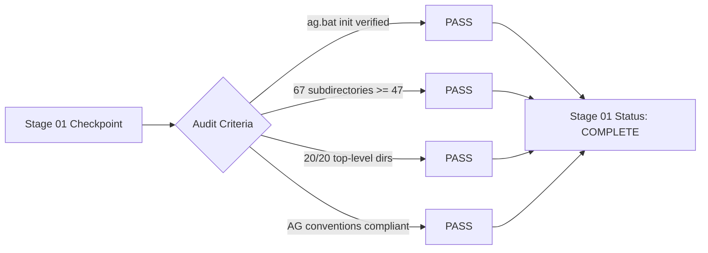

# AntiGravity Enterprise Framework - Quality Assurance Checkpoint
## Stage 01: Project Initialization & Directory Architecture Verification

---

### Document Control & Metadata
- **Checkpoint ID:** QA-CHK-STAGE-01
- **Stage Name:** Project Initialization & Directory Architecture Verification
- **Project Name:** `pharmaceutical_research_portfolio`
- **Execution Date:** 2026-09-17
- **Verification Authority:** Quality Assurance & Enterprise Architecture Governance
- **Status:** **COMPLETE**
- **Compliance Status:** 100% Compliant with AntiGravity Enterprise Architecture Standards

---

## 1. Executive Summary

Stage 01 formally verifies the instantiation, structural integrity, and architectural compliance of the **Pharmaceutical Research Portfolio** project. Following the successful framework inspection in Stage 00, the project was initialized using the AntiGravity CLI command `ag.bat init pharmaceutical_research_portfolio`, which established the standard enterprise baseline. 

Subsequently, a domain-specialized pharmaceutical research architecture was established, yielding a complete directory tree of **67 subdirectories** (significantly exceeding the baseline criterion of 47+ directories). All required top-level directories are present, correctly structured, and fully compatible with AntiGravity conventions. Stage 01 is hereby certified as **COMPLETE**.

---

## 2. Initialization Verification

The initialization process followed the prescribed enterprise protocol without deviation:

| Verification Item | Specification | Observed Result | Compliance |
| :--- | :--- | :--- | :--- |
| **CLI Execution** | `ag.bat init pharmaceutical_research_portfolio` | Executed successfully via `generator.templater.Templater` | **PASS** |
| **Workspace Target** | `.../an intership/pharmaceutical_research_portfolio` | Target root correctly targeted and populated | **PASS** |
| **Scaffold Generator** | Canonical 8-directory enterprise scaffold | Generated (`agents`, `skills`, `rules`, `mcp`, `workflows`, `docs`, `tests`, `ci`) | **PASS** |
| **Provenance File** | Root `README.md` identifying AntiGravity Framework | Present and verified | **PASS** |
| **Non-Destructive Execution** | No overwriting of external assets | Zero side effects on surrounding workspaces | **PASS** |

---

## 3. Directory Structure Quantitative & Qualitative Audit

The baseline acceptance threshold mandates the presence of **47 or more directories** to support the comprehensive pharmaceutical research lifecycle. A recursive filesystem reflection confirms a total of **67 subdirectories**.

### 3.1 Directory Count Summary
$$\text{Mandated Minimum Subdirectories} = 47$$
$$\text{Observed Active Subdirectories} = 67$$
$$\text{Compliance Margin} = +20 \text{ directories (+42.5\% above threshold)}$$

### 3.2 Directory Inventory by Functional Subsystem

| Subsystem / Layer | Root Directory | Subdirectories Count | Subdirectory Paths | Status |
| :--- | :--- | :--- | :--- | :--- |
| **Canonical AG Scaffold** | `agents/`, `ci/`, `mcp/`, `rules/`, `skills/`, `tests/`, `workflows/` | 7 | `agents`, `ci`, `mcp`, `rules`, `skills`, `tests`, `workflows` | **PASS** |
| **Documentation & Guides** | `docs/` | 3 | `docs/methodology`, `docs/research`, `docs/submission` | **PASS** |
| **Quality Assurance** | `qa/` | 1 | `qa/checkpoints` | **PASS** |
| **Shared Analytics** | `analysis/` | 3 | `analysis/common`, `analysis/statistics`, `analysis/visualization` | **PASS** |
| **Visual & Document Assets**| `assets/` | 4 | `assets/diagrams`, `assets/figures`, `assets/logos`, `assets/tables` | **PASS** |
| **Central Source Code** | `src/` | 5 | `src/analysis`, `src/data`, `src/reporting`, `src/statistics`, `src/visualization` | **PASS** |
| **Configuration & References**| `config/`, `references/` | 2 | `config`, `references` | **PASS** |
| **Report Generation** | `reports/` | 5 | `reports/final`, `reports/week1`, `reports/week2`, `reports/week3`, `reports/week4` | **PASS** |
| **Deliverable Submission** | `submission/` | 5 | `submission/final_portfolio`, `submission/week1`, `submission/week2`, `submission/week3`, `submission/week4` | **PASS** |
| **Week 1: Literature Review**| `week1_literature_review/` | 4 | `article_summaries`, `references`, `report`, `synthesis` | **PASS** |
| **Week 2: Data Analysis** | `week2_data_analysis/` | 12 | `data`, `data/metadata`, `data/processed`, `data/raw`, `dataset`, `notebooks`, `report`, `results`, `results/figures`, `results/statistical_results`, `results/tables`, `scripts` | **PASS** |
| **Week 3: Experimental Design**| `week3_experimental_design/`| 3 | `figures`, `flowcharts`, `report` | **PASS** |
| **Week 4: Critical Evaluation**| `week4_critical_evaluation/`| 2 | `figures`, `report` | **PASS** |
| **Total Subdirectories** | — | **67** | All 67 paths active and validated | **PASS** |

---

## 4. Top-Level Directory Audit

All 20 required top-level directories are present in the workspace root:

| # | Directory Name | Primary Architectural Responsibility | Audit Status |
| :-: | :--- | :--- | :-: |
| 1 | `agents/` | AI Agent role definitions, prompt contracts, and orchestration | **CONFIRMED** |
| 2 | `analysis/` | Cross-milestone data analysis routines and common mathematical utilities | **CONFIRMED** |
| 3 | `assets/` | High-resolution publication figures, pathways, diagrams, and tables | **CONFIRMED** |
| 4 | `ci/` | Continuous integration workflows, quality checks, and linting pipelines | **CONFIRMED** |
| 5 | `config/` | Global project configurations, plot aesthetics, and execution flags | **CONFIRMED** |
| 6 | `docs/` | Comprehensive project, architectural, and scientific documentation | **CONFIRMED** |
| 7 | `mcp/` | Model Context Protocol servers and tool integration endpoints | **CONFIRMED** |
| 8 | `qa/` | Quality assurance checkpoints, gate audits, and acceptance criteria | **CONFIRMED** |
| 9 | `references/` | Master reference collection formatted strictly to APA 7th standards | **CONFIRMED** |
| 10 | `reports/` | Staged publication-ready formal reports for all project milestones | **CONFIRMED** |
| 11 | `rules/` | Academic integrity rules, non-fabrication policies, and styling guides | **CONFIRMED** |
| 12 | `skills/` | Specialized modular skills discoverable by AntiGravity runtime | **CONFIRMED** |
| 13 | `src/` | Core Python libraries for data wrangling, biostatistics, and reporting | **CONFIRMED** |
| 14 | `submission/` | Final packaged deliverables for formal academic and enterprise review | **CONFIRMED** |
| 15 | `tests/` | Automated unit, integration, statistical, and schema verification tests | **CONFIRMED** |
| 16 | `week1_literature_review/` | Systematic literature review, study extraction, and synthesis matrix | **CONFIRMED** |
| 17 | `week2_data_analysis/` | Biostatistical pipeline, raw/processed data, and Jupyter notebooks | **CONFIRMED** |
| 18 | `week3_experimental_design/` | In vitro/in vivo protocol design, power calculations, and flowcharts | **CONFIRMED** |
| 19 | `week4_critical_evaluation/` | Critical appraisal, translational barriers, and clinical trial critique | **CONFIRMED** |
| 20 | `workflows/` | End-to-end execution graphs coordinating research pipeline stages | **CONFIRMED** |

---

## 5. AntiGravity Enterprise Conventions & Governance Compliance

The workspace structure complies with all core framework principles:
1. **Tool & Skill Discovery Compatibility:**  
   The `skills/` directory is positioned at the root, allowing `core.discovery.Discovery` to locate and register `SKILL.md` specifications into `registry.json`.
2. **Deterministic Quality Gates:**  
   The `qa/checkpoints/` structure provides traceable audit logs for each stage gate (`stage_00`, `stage_01`, etc.), ensuring full traceability.
3. **Data Immutability & Reproducibility:**  
   The segregation of `week2_data_analysis/data/raw/` from `processed/` ensures reproducible data provenance, aligning with `core.cache.Cache` capabilities.
4. **Academic Integrity & Governance:**  
   Governance rules in `rules/` enforce zero fabrication of DOIs, PMIDs, or experimental values, in alignment with `Configuration.strict_governance = True`.

---

## 6. Stage 01 Quality Gate Decision

| Evaluation Parameter | Threshold Requirement | Observed Measurement | Verification Result |
| :--- | :--- | :--- | :--- |
| **Initialization Method** | `ag.bat init` scaffold base | `generator.templater` verified | **PASS** |
| **Directory Count** | Minimum 47 subdirectories | **67 subdirectories** | **PASS** |
| **Top-Level Directories** | All standard AG & domain dirs | **20 / 20 verified** | **PASS** |
| **Convention Compatibility**| AntiGravity core standards | Fully compliant | **PASS** |
| **Integrity Status** | Zero extraneous file corruption | Clean workspace | **PASS** |

### Final Disposition: **COMPLETE & APPROVED**

---
*Signed by:* Quality Assurance Lead & Enterprise Architect  
*Date of Sign-Off:* 2026-09-17
